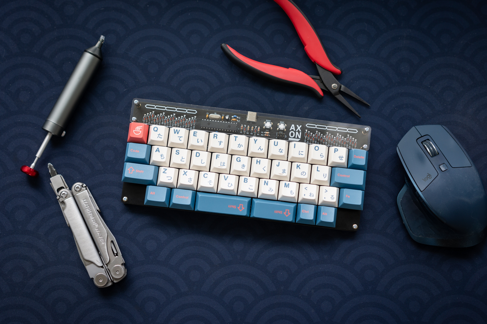
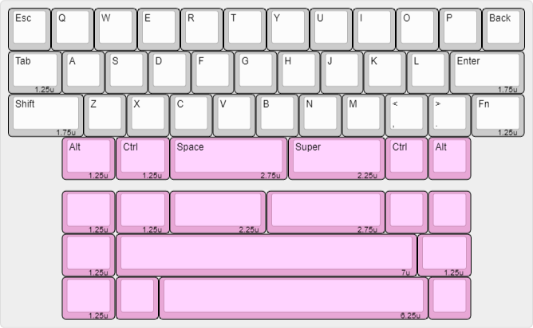
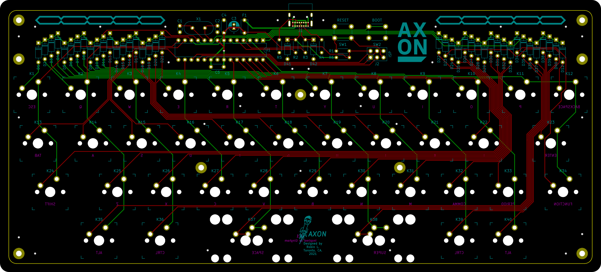

# Axon
[![CC BY-NC-SA 4.0][cc-by-nc-sa-shield]][cc-by-nc-sa]

*Axon version 1.0 built with Durock T1 and GMK Bento*

⚠️ **Using the live github version is not recommended. Please use [a release](https://github.com/thatfellarobin/axon/releases) instead. Performance is not guaranteed outside of official sale (which have not existed so far).**

Axon is a 40% custom mechanical keyboard with through-hole components, inspired by other keyboards such as [gingham](https://github.com/yiancar/gingham_pcb) and [plaid](https://github.com/hsgw/plaid). Axon runs on an ATmega328P using VUSB and QMK.

Notable features include an [HHKB-style](https://happyhackingkb.com/) layout with missing lower corners, and a split spacebar. I never use my right thumb to hit spacebar, so the split allows me to use my right thumb to access additional keyboard layers. A full write-up can be found [on my website](https://www.robinliu.me/axon).

### Images

**Layout:**

**PCB EDA Screenshot:**

### Component Libraries

**Symbols:**
- [Keyboard symbols by Hasu](https://github.com/tmk/kicad_lib_tmk)

**Footprints:**
- [Keyswitches by Daprice](https://github.com/daprice/keyswitches.pretty), but modified for my own tastes/uses.
- My own footprints for silkscreen art. Can be found in `lib/`

### Versions
**1.0:**
- Initial release, production version for personal use.

**1.1:**
- Spacebar widths can be swapped (i.e. 2.25u-2.75u instead of 2.75u-2.25u).
- Added support for 7u and 6.25u spacebars.
- Art is now exposed copper instead of silkscreen.
- Added an indicator LED, which is controlled through QMK as a backlight. This is to enable hardware PWM dimming.
- Update screw placements to ensure acrylic cover symmetry along both x and y axis.
- Fixed issues with stabilizer interference.
- Optimize decoupling capacitor placement.
- Polyfuse now has room to lay horizontally if desired.
- Back side silkscreen accurately reflects default layout.
- Connected shield to ground.
- Numerous minor layout and routing changes.
- Added version number to rear silkscreen.
- Updated license.

## License
This work is licensed under a
[Creative Commons Attribution-NonCommercial-ShareAlike 4.0 International License][cc-by-nc-sa].

[![CC BY-NC-SA 4.0][cc-by-nc-sa-image]][cc-by-nc-sa]

[cc-by-nc-sa]: http://creativecommons.org/licenses/by-nc-sa/4.0/
[cc-by-nc-sa-image]: https://licensebuttons.net/l/by-nc-sa/4.0/88x31.png
[cc-by-nc-sa-shield]: https://img.shields.io/badge/License-CC%20BY--NC--SA%204.0-lightgrey.svg

If you have built upon this project and have significantly altered the design, the non-commercial clause can be waived with explicit permission.

